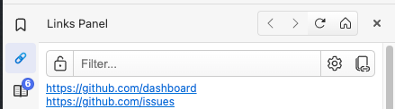
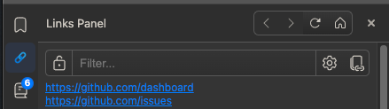

# Links Panel
Links Panel, collecting all the links on a page.  

Forked for use in Vivaldi on macOS. Now it looks as follows:  

## Installing
From source, clone this repository, and then load the `src` folder as an unpacked extension

## What can it do
Grab all the links on the page and show them to you, like classic opera could.

Additionally:
* The links will be styled similarly to how they appear on the page. You can change this in extension settings.
* Searching / filter the links. By default the panel will search through link title, URL and display text.
* Toggle filtering with match case
* Sort the links alphabetically
* See the extension settings page for more info
